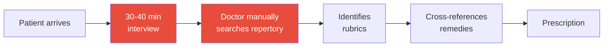
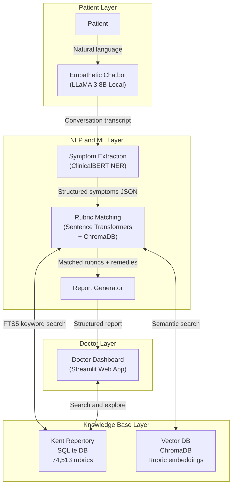
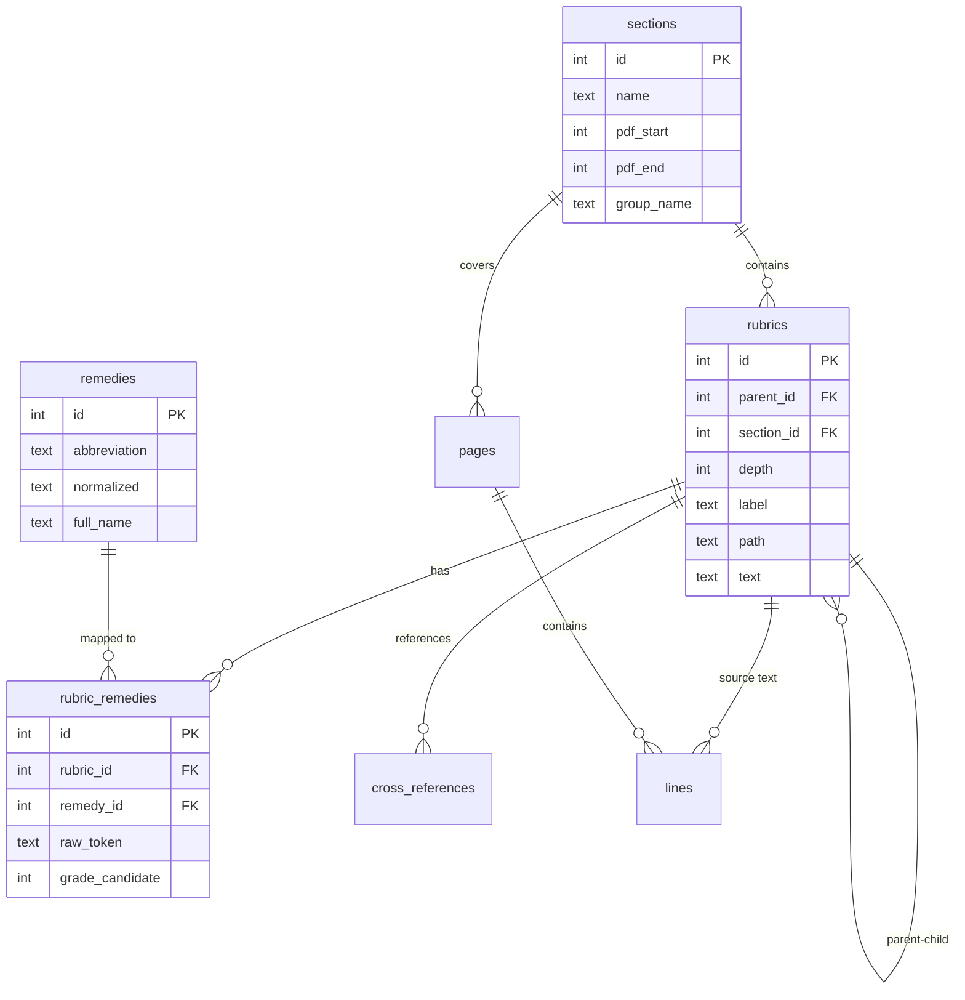
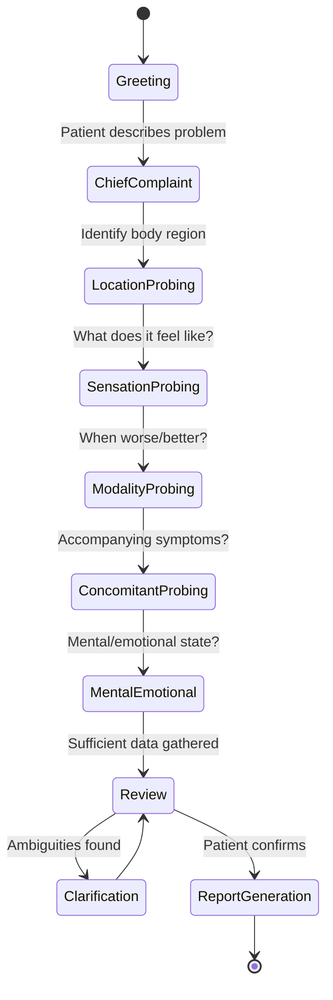
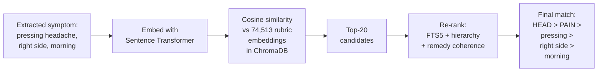

# Project Proposal

## AI-Powered Clinical Assistant for Homeopathic Repertorization Using Kent's Repertory

---

| | |
|---|---|
| **Institution** | Indian Institute of Information Technology, Allahabad (IIIT Allahabad) |
| **Department** | Department of Information Technology |
| **Supervisor** | **Dr. Nikhilanand Arya**, Assistant Professor |
| **Date** | September 2026 |

### Team Members

| Name | Roll Number | Role |
|---|---|---|
| **Krishna Sikheriya** | IIT2023139 | Team Leader |
| Lokesh Bawariya | IIT2023138 | Team Member |
| Naitik Jain | IIB2023036 | Team Member |

### Repository

🔗 [github.com/su4532/kent-repertory-explorer](https://github.com/su4532/kent-repertory-explorer)

---

## 1. Executive Summary

We propose building an **AI-powered clinical assistant** that transforms the homeopathic consultation workflow. The system introduces an empathetic conversational chatbot that conducts preliminary patient interviews, automatically extracts symptoms using NLP, maps them to Kent's Repertory rubrics via semantic search, and generates a structured pre-consultation report for the doctor.

**The core value proposition:** A homeopathic doctor currently spends **30–40 minutes** understanding a patient's symptoms. Our system reduces this to **5–10 minutes** by providing a polished, structured symptom report *before* the physical consultation.

The system is grounded in an open-access **digitized Kent's Repertory database** (developed by `su4532` in `kent-repertory-explorer`) containing **74,513 rubrics**, **679 remedies**, and **507,179 rubric–remedy mappings**, which our team transforms into a dense semantic vector index for neural clinical search.

---

## 2. Problem Statement

### Current Workflow (Without AI)



**Pain points:**
- ⏱️ **Time-intensive:** 30–40 minutes just for symptom gathering, before analysis begins
- 📚 **Information overload:** Kent's Repertory has 74,513 rubrics across 37 sections — manual search is slow and error-prone
- 🧠 **Cognitive burden:** Doctors must hold multiple symptom dimensions (location, sensation, modality, laterality, concomitants) in working memory simultaneously
- ❌ **Inconsistency:** Different practitioners may map the same symptom description to different rubrics

### Proposed Workflow (With AI)


---

## 3. System Architecture

### 3.1 High-Level Architecture


### 3.2 Detailed Component Architecture



---

## 4. Existing Knowledge Base

> [!IMPORTANT]
> **Foundation & Attribution:** Our project leverages and builds upon the digitized Kent's Repertory open-source foundation developed by `su4532` ([github.com/su4532/kent-repertory-explorer](https://github.com/su4532/kent-repertory-explorer)). This provides an initial structured SQLite schema with 74,513 rubrics, 679 remedies, and 507,179 mappings. Having this raw digital foundation in place allows our team to focus directly on the **core machine learning challenges**: dense vector representation, ClinicalBERT symptom NER, synthetic case generation, and conversational clinical reasoning.

### 4.1 Database Statistics

| Metric | Value |
|---|---|
| **Total rubrics** | 74,513 |
| **Total remedies** | 679 |
| **Rubric–remedy mappings** | 507,179 |
| **Cross-references** | 1,923 |
| **Sections/chapters** | 37 (covering all Kent's Repertory content) |
| **Pages digitized** | 1,469 |
| **OCR lines** | 137,062 |
| **Database size** | 112 MB (SQLite, fully indexed) |
| **Full-text search** | FTS5 enabled |

### 4.2 Repertory Coverage — All 37 Sections

| # | Section | Rubrics | # | Section | Rubrics |
|---|---|---|---|---|---|
| 1 | MIND | 4,933 | 20 | PROSTATE GLAND | 93 |
| 2 | VERTIGO | 477 | 21 | URETHRA | 599 |
| 3 | HEAD | 7,240 | 22 | URINE | 428 |
| 4 | EYE | 1,998 | 23 | GENITALIA-MALE | 1,130 |
| 5 | VISION | 954 | 24 | GENITALIA-FEMALE | 1,461 |
| 6 | EAR | 2,189 | 25 | LARYNX AND TRACHEA | 731 |
| 7 | HEARING | 188 | 26 | RESPIRATION | 842 |
| 8 | NOSE | 1,680 | 27 | COUGH | 1,555 |
| 9 | FACE | 2,266 | 28 | EXPECTORATION | 363 |
| 10 | MOUTH | 1,668 | 29 | CHEST | 3,830 |
| 11 | TEETH | 798 | 30 | BACK | 4,115 |
| 12 | THROAT | 980 | 31 | EXTREMITIES | 17,179 |
| 13 | THROAT-EXTERNAL | 325 | 32 | SLEEP | 1,144 |
| 14 | STOMACH | 3,132 | 33 | CHILL | 764 |
| 15 | ABDOMEN | 4,095 | 34 | FEVER | 583 |
| 16 | RECTUM | 1,415 | 35 | PERSPIRATION | 404 |
| 17 | STOOL | 283 | 36 | SKIN | 1,301 |
| 18 | BLADDER | 778 | 37 | GENERALITIES | 2,336 |
| 19 | KIDNEYS | 256 | | | |

> Sections 18–22 (Bladder through Urine) are grouped under **Urinary Organs** in the original text. The database correctly represents this grouping via the `group_name` field.

### 4.3 Database Schema



---

## 5. Methodology

### 5.1 Empathetic Chatbot (Conversational Agent)

The chatbot is the patient's first point of contact. Unlike a rigid questionnaire, it conducts a **natural, empathetic conversation** that systematically gathers the symptom dimensions critical to homeopathic case-taking.

#### Conversation State Machine



#### Homeopathic Symptom Dimensions Captured

| Dimension | What it captures | Example |
|---|---|---|
| **Location** | Body part/region | "Right side of head" |
| **Sensation** | Type of feeling | "Pressing, throbbing, burning" |
| **Modality** | Aggravation/amelioration | "Worse in morning, better by pressure" |
| **Laterality** | Left/right/bilateral | "Left-sided" |
| **Concomitant** | Accompanying symptoms | "With nausea and anxiety" |
| **Mental/Emotional** | Psychological state | "Irritable, restless at night" |
| **Temporality** | Time patterns | "Worse at midnight, periodic" |

#### Architecture: Hybrid LLM + Structured State Tracking

- **LLaMA 3 (8B)** running locally via Ollama handles the natural conversation
- A **structured JSON state tracker** ensures all symptom dimensions are progressively filled
- The system prompt is specifically designed for homeopathic case-taking methodology

### 5.2 NLP Symptom Extraction Pipeline


#### Extraction Example

**Patient says:** *"I have this terrible headache, mostly on the right side, it gets worse in the morning and feels like something pressing on my head."*

| Dimension | Extracted Value | Mapped Rubric Path |
|---|---|---|
| Chief complaint | Headache | `HEAD > PAIN` |
| Laterality | Right side | `HEAD > PAIN > right side` |
| Modality (time) | Morning | `HEAD > PAIN > morning` |
| Sensation | Pressing | `HEAD > PAIN > pressing` |

#### Model Selection: Why Transformers over RNNs

| Criterion | RNN (LSTM/GRU) | BERT / Transformers |
|---|---|---|
| Context window | Degrades over long sequences | Full bidirectional attention |
| Pre-training | Must train from scratch | Transfer learning from medical corpora |
| Data efficiency | Needs 10K+ examples | Works with 2K–5K fine-tuning examples |
| Medical variants | None available | BioBERT, ClinicalBERT, PubMedBERT |
| NER performance | F1 ~78–85% | **F1 ~88–95%** |
| State of the art | No (2017 era) | **Yes (2024–2026)** |

**Decision:** We use **ClinicalBERT** fine-tuned for homeopathic Named Entity Recognition, with **LLM-based extraction as a complementary rapid-prototyping tool**.

### 5.3 Semantic Rubric Matching

The core challenge: mapping extracted symptoms to the correct rubric among **74,513 candidates**.



**Why semantic search over keyword search?**
- Patient says *"my head feels like it's in a vice"* — no keyword match for "pressing"
- Semantic embeddings capture that "vice-like" is similar to "pressing" / "constricting"
- Hybrid approach: semantic similarity (recall) + keyword validation (precision)

### 5.4 Synthetic Case Generation

No public homeopathic case dataset exists with the granularity required for training. We generate our own using a **ground-truth-driven reverse pipeline**.


#### Generation Pipeline

```
FOR each rubric combination sampled from the database:
    1. Look up the remedy intersection from rubric_remedies
    2. Prompt LLaMA 3 (8B):
       "Generate a realistic patient narrative for these rubrics: [list].
        Make it conversational and natural. Include modalities and sensations."
    3. Store: (narrative, rubrics, remedies) as a training triple
    4. Validate: Check that the narrative -> extraction -> matching pipeline 
       recovers the original rubrics (self-validation)
```

#### Scale Targets

| Phase | Cases | Method |
|---|---|---|
| Phase 1 | 5,000 | LLM generation from rubric combinations |
| Phase 2 | 20,000 | Augmentation (rephrase, register variation, noise injection) |
| Phase 3 | 500 | Gold standard (validated against published case studies) |

### 5.5 Doctor Dashboard

A **Streamlit web application** providing:

- 📋 **Patient report viewer** — Structured symptom summary with matched rubrics and remedies
- 🔍 **Knowledge base search** — Full-text and semantic search across the entire repertory
- 🌳 **Rubric tree explorer** — Navigate the 37-section hierarchy interactively
- 💊 **Remedy lookup** — Find all rubrics where a remedy appears, with grade information
- 💬 **Conversation transcript** — Review the full patient-chatbot interaction

---

## 6. Technical Stack

| Component | Technology | Rationale |
|---|---|---|
| **Knowledge Base** | SQLite (existing) + ChromaDB | Structured queries + semantic vector search |
| **Embeddings** | `all-MiniLM-L6-v2` / `BioSentVec` | Fast, accurate, medical-domain aware |
| **Chatbot LLM** | LLaMA 3 (8B) via Ollama | Local, private, zero API cost |
| **Symptom NER** | ClinicalBERT (HuggingFace) | Best medical NER performance |
| **Synthetic data** | LLaMA 3 + repertory DB | Ground-truth-driven, no external dependency |
| **Backend** | FastAPI (Python) | Clean API boundaries, async support |
| **Frontend** | Streamlit | Rapid prototyping, Python-native |
| **Experiment tracking** | MLflow / W&B | Reproducibility |
| **Language** | Python 3.10+ | Unified ML + web stack |

---

## 7. Implementation Roadmap

### Phase 1: Foundation
- [ ] Generate embeddings for all 74,513 rubric paths
- [ ] Store in ChromaDB; build semantic search API
- [ ] Build synthetic case generator; generate initial 1,000 cases
- [ ] Define evaluation metrics: Rubric Match Accuracy, Remedy Recall@k, Conversation Completeness

### Phase 2: Core ML
- [ ] Fine-tune ClinicalBERT on synthetic + hand-corrected data
- [ ] Build chatbot prototype with structured state tracking
- [ ] System prompt design for homeopathic case-taking
- [ ] End-to-end: conversation to extraction to rubric search
- [ ] Scale synthetic data to 5,000+ cases

### Phase 3: Integration
- [ ] Build Streamlit doctor dashboard (report viewer, KB search, rubric explorer)
- [ ] End-to-end evaluation: simulate 50+ cases
- [ ] Benchmark time-to-diagnosis improvement

### Phase 4: Research Output
- [ ] Write and submit paper(s)
- [ ] Open-source the dataset and tools
- [ ] Plan Materia Medica integration as future extension

---

## 8. Novel Research Contributions

This project offers **four distinct publishable contributions**:

### 8.1 First Dense Semantic Vector Index for Kent's Repertory
While `su4532` provides a raw digitized SQLite text database with keyword search, no existing open-access work has transformed this classical text into an **ML-ready semantic vector space**. We generate and open-source dense sentence embeddings across all 74,513 hierarchical rubric paths in ChromaDB, enabling neural semantic retrieval that bridges modern conversational patient complaints to 19th-century medical rubrics.

### 8.2 HomeoNER: Homeopathic NER Benchmark Dataset
No public annotated dataset exists for homeopathic symptom extraction. Our synthetic generation pipeline creates the **first benchmark dataset** for this task.

### 8.3 Conversational Case-Taking with Grounded Output
Existing chatbot research in homeopathy is surface-level (rule-based, no real evaluation). Our system combines LLM empathy with structured rubric grounding — a novel hybrid architecture.

### 8.4 Repertory Graph Analysis
The 1,923 cross-references in the database form a graph that has never been analyzed computationally. Network analysis can reveal latent symptom clusters and remedy affinities.

---

## 9. Literature Survey

| Project / Paper | What they did | How we differ |
|---|---|---|
| [**HomeoGPT**](https://homeogpt.in) (Ghosh et al., 2024) | LLM-based homeopathic remedy suggestion and clinical dialogue | We ground reasoning in a verified 74k-rubric SQLite database rather than unconstrained generative outputs |
| [**HOHM Study**](https://pubmed.ncbi.nlm.nih.gov/39536836/) (HOHM Foundation, 2025) | Evaluated AI remedy finders vs. live homeopaths on 100 acute cases (59% match rate) | We focus on pre-consultation case-taking and rubric mapping assistance, not autonomous prescribing |
| [**AI-Aided Homeopathic Clinic**](https://doi.org/10.22270/jddt.v14i1.6383) (JDDT, 2026) | Conceptual multi-modal framework (voice tone, facial expression, language) | We focus first on robust text-based NLP and semantic rubric retrieval; multi-modal is future work |
| [**Symptom-BERT**](https://www.ncbi.nlm.nih.gov/pmc/articles/PMC11132890/) (Zeinali et al., 2024) | Pre-trained and fine-tuned BERT for symptom NER in EHR clinical notes | We adapt and fine-tune for homeopathic vocabulary (modalities, sensations, concomitants, locations) |
| [**Synthea**](https://academic.oup.com/jamia/article/25/3/230/4098287) ([GitHub](https://github.com/synthetichealth/synthea)) (Walonoski et al., 2018) | Synthetic patient record generator for conventional clinical scenarios | We build a domain-specific synthetic case generator grounded in combinatorial repertory rubrics |
| [**BioBERT**](https://academic.oup.com/bioinformatics/article/36/4/1234/5566506) / [**ClinicalBERT**](https://aclanthology.org/W19-1902/) (2019–2020) | Domain-adapted transformers for biomedical and clinical text | We fine-tune these architectures on our HomeoNER corpus for homeopathic symptom NER |

---

## 10. Risk Assessment

| Risk | Impact | Mitigation |
|---|---|---|
| OCR errors in rubric labels | Incorrect rubric matches | DB has 7,510 flagged issues; prioritize high-traffic rubrics |
| Unverified remedy grades | `grade` is NULL; only `grade_candidate` exists | Use as soft signal; document limitation |
| LLM hallucination | Fabricated rubrics or remedies | Always validate against DB; never trust ungrounded output |
| No real patient data | Cannot validate against live cases initially | Synthetic data + published case studies as benchmarks |
| LLaMA 8B capacity limits | May struggle with complex extraction | Use structured prompting; complement with fine-tuned ClinicalBERT |

---

## 11. References

1. Kent, J.T. *Repertory of the Homoeopathic Materia Medica, Expanded.* (Digitized edition: [github.com/su4532/kent-repertory-explorer](https://github.com/su4532/kent-repertory-explorer))
2. Medi-T. *Kent's Repertory Online.* [homeoint.org/books/kentrep](http://homeoint.org/books/kentrep/index.htm), 1998.
3. Ghosh, S., et al. "HomeoGPT: AI-Powered Clinical Decision Support in Homeopathy." [homeogpt.in](https://homeogpt.in), 2024.
4. Institute for the Advancement of Homeopathy (HOHM Foundation). "The Application of Artificial Intelligence in Acute Prescribing in Homeopathy: A Comparative Retrospective Study." *Homeopathy* / [PubMed PMID: 39536836](https://pubmed.ncbi.nlm.nih.gov/39536836/), 2025.
5. "Artificial Intelligence [AI] and Homoeopathy: Applicability, Reliability, Validity and Limitations of an AI-Aided Homoeopathic Clinic." *Journal of Drug Delivery and Therapeutics*, [DOI: 10.22270/jddt.v14i1.6383](https://doi.org/10.22270/jddt.v14i1.6383), 2026.
6. Zeinali, N., Albashayreh, A., Fan, W., White, S.G. "Symptom-BERT: Enhancing Cancer Symptom Detection in EHR Clinical Notes." *J. Pain Symptom Manage.*, [PMC11132890](https://www.ncbi.nlm.nih.gov/pmc/articles/PMC11132890/), [DOI: 10.1016/j.jpainsymman.2024.04.015](https://doi.org/10.1016/j.jpainsymman.2024.04.015), 2024.
7. Walonoski, J., et al. "Synthea: An approach, method, and software for generating synthetic patients." *JAMIA*, [DOI: 10.1093/jamia/ocx079](https://academic.oup.com/jamia/article/25/3/230/4098287), 2018. ([Source Code](https://github.com/synthetichealth/synthea))
8. Lee, J., et al. "BioBERT: a pre-trained biomedical language representation model." *Bioinformatics*, [DOI: 10.1093/bioinformatics/btz682](https://academic.oup.com/bioinformatics/article/36/4/1234/5566506), 2020. ([Source Code](https://github.com/dmis-lab/biobert))
9. Alsentzer, E., et al. "Publicly Available Clinical BERT Embeddings." *NAACL Clinical NLP Workshop*, [ACL W19-1902](https://aclanthology.org/W19-1902/), [arXiv:1904.03323](https://arxiv.org/abs/1904.03323), 2019.
10. Reimers, N., Gurevych, I. "Sentence-BERT: Sentence Embeddings using Siamese BERT-Networks." *EMNLP*, [arXiv:1908.10084](https://arxiv.org/abs/1908.10084), 2019.
11. Touvron, H., et al. "LLaMA: Open and Efficient Foundation Language Models." *Meta AI*, [arXiv:2302.13971](https://arxiv.org/abs/2302.13971), 2023.

---

*Prepared by Team — Krishna Sikheriya, Lokesh Bawariya, Naitik Jain*
*Under the supervision of Dr. Nikhilanand Arya, IIIT Allahabad*
*September 2026*
