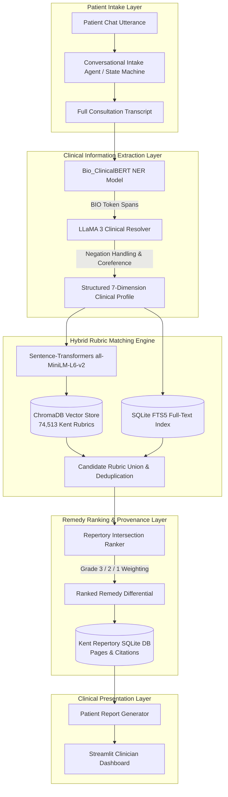

# 📐 System Architecture

**Kent-AI: AI-Powered Clinical Assistant for Homeopathic Repertorization**

---

## 1. High-Level System Architecture

---

## 2. Kent's 7 Symptom Dimensions

| Dimension | Description | Example Entities |
|---|---|---|
| **Location (LOC)** | Anatomical organ, tissue, or lateral side | *Right temple, epigastrium, occiput* |
| **Sensation (SEN)** | Quality or character of discomfort | *Throbbing, burning, stitching, stitching like splinters* |
| **Modality: Worse (MOD_AGG)** | Factors that trigger or aggravate symptoms | *Cold drafts, motion, stepping hard, evening* |
| **Modality: Better (MOD_AMEL)** | Factors that soothe or relieve symptoms | *Warm wraps, lying down, hard pressure, fresh air* |
| **Concomitants (CONC)** | Unrelated symptoms co-occurring simultaneously | *Nausea with headache, perspiration during chill* |
| **Temporal (TEMP)** | Exact circadian timing of recurrence | *Aggravation at 3 AM, periodicity every 7 days* |
| **Mental/Emotional (MENT)** | Psychological and dispositional state | *Fear of dark, weeping when spoken to, restlessness* |

---

## 3. Database & Storage Architecture
- **Raw Layer**: `data/raw/repertory.sqlite` contains 37 sections, 74,513 rubrics, 500,000+ remedy links, and OCR bounding boxes.
- **Vector Layer**: `data/embeddings/kent_rubrics` persistent ChromaDB HNSW collection with cosine distance.
- **Processed Layer**: `data/processed/` contains partitioned JSONL sets for fine-tuning and evaluation.
