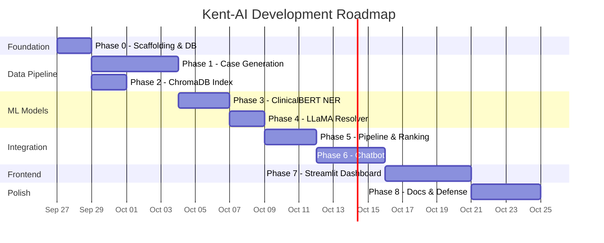

# 🏗️ Project Foundation — Repository, Structure & Roadmap

## AI-Powered Clinical Assistant for Homeopathic Repertorization

---

## 1. Repository Name — Options

| Name | Rationale |
|---|---|
| **`kent-ai`** | **(Recommended)** — Short, memorable, searchable. "Kent" grounds it in the domain; "AI" signals the tech. |
| `repertorium` | Latin for "repertory" — elegant, one-word, unique on GitHub. |
| `homeo-ai` | Broader domain scope, good if the project expands beyond Kent. |
| `sympto-match` | Describes the core action (symptom → rubric matching). |

> [!TIP]
> `kent-ai` is the strongest choice: 7 characters, instantly tells a reader *what* (Kent's Repertory) and *how* (AI). Clean as a CLI command too: `kent-ai serve`.

---

## 2. Repository Structure

```
kent-ai/
│
├── README.md                          # Project overview, setup, and quick start
├── LICENSE                            # MIT or Apache-2.0
├── .gitignore                         # Python, venv, model weights, .env, *.sqlite
├── pyproject.toml                     # Single source of truth for deps & project metadata
├── Makefile                           # Shortcut commands: make setup, make train, make serve
│
├── configs/                           # All YAML/JSON configuration files
│   ├── model.yaml                     # ClinicalBERT hyperparams, label schema
│   ├── generation.yaml                # LLaMA generation params, prompts, batch size
│   ├── chromadb.yaml                  # Embedding model, collection name, distance metric
│   └── chatbot.yaml                   # Conversation state machine config, max turns
│
├── data/                              # Data assets (gitignored for large files)
│   ├── raw/                           # Immutable source data
│   │   └── repertory.sqlite           # Symlinked from kent_public_edition/
│   ├── processed/                     # Generated artifacts
│   │   ├── mind_cases.jsonl           # Synthetic cases (generated by LLaMA)
│   │   ├── train.jsonl                # 80% split
│   │   ├── val.jsonl                  # 10% split
│   │   └── test.jsonl                 # 10% split
│   └── embeddings/                    # ChromaDB persistent storage
│       └── kent_rubrics/              # Pre-computed rubric embeddings
│
├── src/                               # All source code lives here
│   ├── __init__.py
│   │
│   ├── data/                          # Data loading, splitting, preprocessing
│   │   ├── __init__.py
│   │   ├── kent_db.py                 # SQLite reader: sections, rubrics, remedies
│   │   ├── case_generator.py          # LLaMA-based synthetic case generation
│   │   ├── bio_tagger.py              # Auto-label cases with BIO tags
│   │   └── splitter.py                # Train/val/test splitting logic
│   │
│   ├── models/                        # ML model definitions and training
│   │   ├── __init__.py
│   │   ├── symptom_ner.py             # ClinicalBERT NER model wrapper
│   │   ├── trainer.py                 # Training loop, early stopping, metrics
│   │   └── resolver.py                # LLaMA 3 post-processor (negation, coreference)
│   │
│   ├── search/                        # Rubric matching engine
│   │   ├── __init__.py
│   │   ├── embedder.py                # Sentence embedding (MiniLM) for rubrics
│   │   ├── vector_store.py            # ChromaDB wrapper: index, query, batch ops
│   │   └── ranker.py                  # Remedy ranking by rubric intersection score
│   │
│   ├── chatbot/                       # Conversational agent
│   │   ├── __init__.py
│   │   ├── state_machine.py           # Conversation flow: states, transitions
│   │   ├── dialogue_manager.py        # Turn management, context window
│   │   └── prompts.py                 # All LLaMA prompt templates (single source)
│   │
│   ├── pipeline/                      # End-to-end orchestration
│   │   ├── __init__.py
│   │   ├── orchestrator.py            # Full pipeline: transcript → report
│   │   └── report_generator.py        # Structured report builder (JSON + markdown)
│   │
│   └── dashboard/                     # Streamlit doctor-facing UI
│       ├── __init__.py
│       ├── app.py                     # Main Streamlit entry point
│       ├── pages/
│       │   ├── patient_report.py      # Symptom report viewer
│       │   ├── rubric_explorer.py     # Interactive Kent tree navigator
│       │   └── remedy_lookup.py       # Remedy → rubric reverse search
│       └── components/
│           ├── rubric_tree.py         # Tree widget for Kent hierarchy
│           └── chat_viewer.py         # Conversation transcript renderer
│
├── scripts/                           # Standalone runnable scripts
│   ├── generate_cases.py              # CLI: generate synthetic cases with checkpointing
│   ├── build_embeddings.py            # CLI: build ChromaDB index from repertory.sqlite
│   ├── train_ner.py                   # CLI: fine-tune ClinicalBERT
│   ├── evaluate.py                    # CLI: run eval on test split
│   └── export_model.py               # CLI: package model for deployment
│
├── notebooks/                         # Exploratory Jupyter notebooks (Colab-ready)
│   ├── 01_eda_repertory.ipynb         # Explore sections, rubric counts, remedy dist.
│   ├── 02_case_generation_demo.ipynb  # Demo: generate 5 cases, inspect quality
│   ├── 03_train_clinicalbert.ipynb    # Full Colab training notebook
│   └── 04_pipeline_demo.ipynb         # End-to-end demo: text → report
│
├── tests/                             # Unit and integration tests
│   ├── __init__.py
│   ├── test_kent_db.py                # DB reader tests
│   ├── test_bio_tagger.py             # BIO labeling correctness
│   ├── test_symptom_ner.py            # NER inference tests
│   ├── test_vector_store.py           # ChromaDB query tests
│   └── test_pipeline.py              # End-to-end integration test
│
└── docs/                              # Documentation and research
    ├── architecture.md                # System architecture diagrams
    ├── api_reference.md               # Internal API docs
    ├── evaluation_results.md          # Final metrics and analysis
    └── proposal/                      # Project proposal (existing)
        └── Project_Proposal.md
```

### Design Principles

| Principle | Implementation |
|---|---|
| **Separation of Concerns** | Each `src/` subdirectory owns one domain: data, models, search, chatbot, pipeline, dashboard |
| **Config over Code** | All hyperparameters, prompts, and model paths live in `configs/` YAML, never hardcoded |
| **Scripts ≠ Library** | `scripts/` are CLI entry points that import from `src/`. Testable logic stays in `src/` |
| **Reproducibility** | Random seeds in configs, deterministic splits, checkpointed generation |
| **Git-friendly** | Large files (`.sqlite`, model weights, `.jsonl`) are `.gitignored`; only code and configs tracked |

---

## 3. Phased Roadmap

> [!IMPORTANT]
> **Execution Model:** Each phase is a self-contained milestone. Flash executes it. After completion, switch to Opus/Sonnet for review, course correction, and fleshing out the next phase.

---

### Phase 0 — Scaffolding & Data Layer `[Day 1–2]`

**Goal:** Create the repo skeleton and wire up the Kent SQLite reader.

| Task | File(s) | Details |
|---|---|---|
| Initialize repo structure | `pyproject.toml`, `.gitignore`, `Makefile`, all `__init__.py` | Create every directory and placeholder file from the tree above |
| Kent DB reader | `src/data/kent_db.py` | Functions: `get_sections()`, `get_rubrics(section_id)`, `get_rubric_path(rubric_id)`, `get_remedies(rubric_id)`, `get_mind_rubrics()` |
| Config system | `configs/model.yaml`, `configs/generation.yaml` | YAML loader utility + default configs |
| Unit tests for DB reader | `tests/test_kent_db.py` | Verify rubric counts, path resolution, remedy grades |
| EDA notebook | `notebooks/01_eda_repertory.ipynb` | Section distribution, MIND rubric exploration |

**Exit Criteria:** `python -c "from src.data.kent_db import get_mind_rubrics; print(len(get_mind_rubrics()))"` prints `4933`.

---

### Phase 1 — Synthetic Case Generation `[Day 3–7]`

**Goal:** Generate ~22,200 MIND cases using LLaMA 3 8B with crash-safe checkpointing.

| Task | File(s) | Details |
|---|---|---|
| Case generator core | `src/data/case_generator.py` | Prompt templates, Ollama integration, JSON mode output, one case = {rubric, narrative, entities} |
| Generation prompts | `src/chatbot/prompts.py` | Centralized prompt templates for case generation |
| BIO auto-tagger | `src/data/bio_tagger.py` | Convert entity spans from LLaMA output → BIO-tagged token sequences |
| CLI generation script | `scripts/generate_cases.py` | Checkpointed JSONL writer, progress bar, resume-from-crash |
| Data splitter | `src/data/splitter.py` | Stratified 80/10/10 split, reproducible seed |
| Demo notebook | `notebooks/02_case_generation_demo.ipynb` | Generate 5 cases, visually inspect quality |
| Config | `configs/generation.yaml` | Temperature, max_tokens, batch_size, model_name |

**Exit Criteria:**
- `mind_cases.jsonl` contains ≥22,000 cases
- `train.jsonl` / `val.jsonl` / `test.jsonl` are created with correct split ratios
- 5 randomly sampled cases pass manual quality review

**Hardware Plan:**
```
1. SSH into college GPU → nvidia-smi → identify GPU
2. nohup python scripts/generate_cases.py > generation.log 2>&1 &
3. Script saves every case immediately (crash-safe)
4. Monitor: tail -f generation.log
```

---

### Phase 2 — ChromaDB Rubric Index `[Day 5–6]` *(overlaps with Phase 1 generation)*

**Goal:** Build the semantic search engine over all 74,513 rubrics.

| Task | File(s) | Details |
|---|---|---|
| Sentence embedder | `src/search/embedder.py` | Load `all-MiniLM-L6-v2`, embed rubric path strings |
| Vector store wrapper | `src/search/vector_store.py` | ChromaDB: create collection, upsert embeddings, query top-K |
| Index builder script | `scripts/build_embeddings.py` | Batch-embed all rubrics, persist to `data/embeddings/` |
| Unit tests | `tests/test_vector_store.py` | Known rubric queries return expected top-5 results |

**Exit Criteria:** Query `"splitting headache from sun"` returns `HEAD > PAIN > Sun, from exposure to` in top-5 results.

---

### Phase 3 — ClinicalBERT NER Training `[Day 8–10]`

**Goal:** Fine-tune Bio_ClinicalBERT on HomeoNER task.

| Task | File(s) | Details |
|---|---|---|
| NER model wrapper | `src/models/symptom_ner.py` | HuggingFace `AutoModelForTokenClassification`, label map, inference API |
| Training loop | `src/models/trainer.py` | Epoch loop, early stopping (patience=3), best-checkpoint saving, WandB/TensorBoard logging |
| Config | `configs/model.yaml` | `learning_rate: 2e-5`, `epochs: 10`, `batch_size: 16`, `max_seq_length: 256`, label schema |
| Colab notebook | `notebooks/03_train_clinicalbert.ipynb` | Self-contained Colab notebook: mount Drive, load data, train, save to Drive |
| Training script | `scripts/train_ner.py` | CLI alternative to notebook for college GPU |

**Exit Criteria:**
- Token-level F1 ≥ 88% on validation set
- Saved model checkpoint in `data/models/clinicalbert_homeoNER/`

**Hardware:** Google Colab T4 free tier (~35–50 min training time).

---

### Phase 4 — LLaMA 3 Post-Processor `[Day 11–12]`

**Goal:** Wire the LLaMA 3 resolver that takes ClinicalBERT spans + transcript → clean 7-dimension JSON.

| Task | File(s) | Details |
|---|---|---|
| Resolver module | `src/models/resolver.py` | Ollama client, JSON mode, negation resolution, coreference linking |
| Prompt templates | `src/chatbot/prompts.py` | Add resolver-specific prompts with few-shot examples |
| Unit tests | `tests/test_pipeline.py` | Known transcript → expected 7-dim JSON output |

**Exit Criteria:** Given a sample patient transcript, the resolver outputs a valid 7-dimension symptom JSON with zero hallucinated entities.

---

### Phase 5 — Remedy Ranking & Pipeline Orchestrator `[Day 13–15]`

**Goal:** Connect all components into a single `transcript → report` pipeline.

| Task | File(s) | Details |
|---|---|---|
| Remedy ranker | `src/search/ranker.py` | Rubric intersection scoring, grade-weighted ranking |
| Pipeline orchestrator | `src/pipeline/orchestrator.py` | `process_transcript(text) → PatientReport` — calls NER → Resolver → ChromaDB → Ranker |
| Report generator | `src/pipeline/report_generator.py` | Structured JSON + human-readable markdown report |
| End-to-end notebook | `notebooks/04_pipeline_demo.ipynb` | Full demo: paste a transcript, get a report |
| Evaluation script | `scripts/evaluate.py` | Run test split through pipeline, compute F1, Top-K Recall, MRR |

**Exit Criteria:**
- `python scripts/evaluate.py` completes on 2,220 test cases
- Token-level F1 ≥ 88%, Top-20 Rubric Recall ≥ 90%, MRR ≥ 0.65

---

### Phase 6 — Conversational Chatbot `[Day 16–19]`

**Goal:** Build the patient-facing empathetic chatbot with state machine.

| Task | File(s) | Details |
|---|---|---|
| Conversation state machine | `src/chatbot/state_machine.py` | States: GREETING → CHIEF_COMPLAINT → LOCATION → SENSATION → MODALITY → CONCOMITANT → MENTAL → REVIEW → CLARIFICATION → DONE |
| Dialogue manager | `src/chatbot/dialogue_manager.py` | Turn management, history tracking, dimension completeness check |
| Prompt templates | `src/chatbot/prompts.py` | Add chatbot system/user prompts for each state |
| Integration with pipeline | Wire chatbot output → `orchestrator.process_transcript()` |

**Exit Criteria:** A 7-turn simulated conversation fills all 7 symptom dimensions and triggers report generation.

---

### Phase 7 — Streamlit Doctor Dashboard `[Day 20–24]`

**Goal:** Build the doctor-facing UI.

| Task | File(s) | Details |
|---|---|---|
| Main app | `src/dashboard/app.py` | Streamlit multi-page layout, session state management |
| Patient report page | `src/dashboard/pages/patient_report.py` | 7-dim symptom cards, matched rubrics, remedy ranking |
| Rubric explorer page | `src/dashboard/pages/rubric_explorer.py` | Interactive Kent tree with search |
| Remedy lookup page | `src/dashboard/pages/remedy_lookup.py` | Reverse lookup: remedy → all rubrics |
| Components | `src/dashboard/components/` | Reusable tree widget, chat transcript viewer |

**Exit Criteria:** `streamlit run src/dashboard/app.py` serves a functional dashboard showing a pre-generated patient report, rubric tree, and remedy lookup.

---

### Phase 8 — Polish, Docs & Defense Prep `[Day 25–28]`

| Task | Details |
|---|---|
| `README.md` | Setup instructions, architecture diagram, screenshots, usage examples |
| `docs/architecture.md` | Mermaid diagrams of the full pipeline |
| `docs/evaluation_results.md` | Final metrics tables, error analysis, comparison with baselines |
| Edge case testing | Empty transcripts, single-word inputs, non-English text, adversarial inputs |
| Demo recording | Screen recording of chatbot → dashboard flow for defense presentation |

---

## 4. Dependency Stack

```toml
# pyproject.toml [project.dependencies]
dependencies = [
    "torch>=2.0",
    "transformers>=4.35",
    "datasets>=2.14",
    "chromadb>=0.4",
    "sentence-transformers>=2.2",
    "ollama>=0.1",
    "streamlit>=1.28",
    "pyyaml>=6.0",
    "tqdm>=4.65",
    "scikit-learn>=1.3",
    "seqeval>=1.2",       # BIO-tag evaluation
]
```

---

## 5. Timeline Summary



---

*Prepared: September 2026 | IIIT Allahabad — Team: Krishna Sikheriya, Lokesh Bawariya, Naitik Jain*
